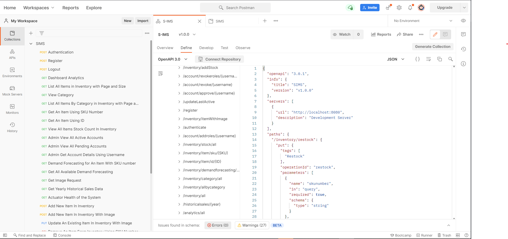

# SIMS Web API
Smart Inventory Management System (S-IMS) backend Web API

## Overview
S-IMS backend is built using Spring Boot and PostgreSQL as the database server.

S-IMS is an inventory management system equipped with  data visualisation and demand forecasting.

Its frontend is built using Angular and FusionCharts (available in another repository [sims-frontend](https://github.com/ebiggerr/sims-frontend) and both of them communicates using HTTP requests.

## Using Postman



##### OpenAPI/Swagger documentation

The documentation of API is available on [here](https://github.com/ebiggerr/sims-backend/blob/prod/openapi.json).

Some of the endpoints:
- localhost:8080/authenticate
- localhost:8080/analytics/all
- localhost:8080/inventory/demand/all
 
## Dependencies
1. Auth0 java-jwt
2. Spring Data JPA
3. Hibernate
4. PostgreSQL driver
5. Undertow
6. Spring Boot

## Build and Run
The project is built using Gradle build tool.

##### Clone this project from GitHub
```$xslt
git clone https://github.com/ebiggerr/sims-backend.git
cd backend
```

```$xslt
gradlew bootRun
```
using the wrapper (Gradle) in this project to launch the application.

```$xslt
gradle bootRun
```
using local Gradle in your machine to launch the application

## Documentation

##### How to configure the application

- Database connection

The configuration can be done on the application.properties ( location : src/main/resources/application.properties) by specify the database url, account credentials such as username and password using 
```
spring.profiles.active=dev (remove this if you want the application.properties to be default)

spring.datasource.url=jdbc:postgresql://{yourDomain}:{yourPort}/{yourDatabaseName}
spring.datasource.username={yourDatabaseUsername}
spring.datasource.password={yourDatabasePassworrd}

spring.datasource.platform=postgres ( in this case I used PostgreSQL )
spring.datasource.driver-class-name=org.postgresql.Driver
spring.jpa.database-platform = org.hibernate.dialect.PostgreSQL10Dialect

```

- OpenAPI/Swagger configuration

```$xslt
springdoc.api-docs.path=/api-docs
springdoc.swagger-ui.operationsSorter=method
```


## Database Schema

Sample Data and Database Schema is available in the project.

```
#Sample Data
/src/main/resources/postgresql/inserts.sql

#Schema
/src/main/resources/postgresql/schema of database.sql

```
or you can click [here](https://github.com/ebiggerr/sims-backend/tree/prod/src/main/resources/postgresql)

PostgreSQL is recommended if you want to run this project locally on your machine because some SQL query used in the application might not gonna work on other database such as MySQL, MS SQL Server, and etc.

Native query is used on the data access layer, it is intentional despite the use of Hibernate as the ORM.


